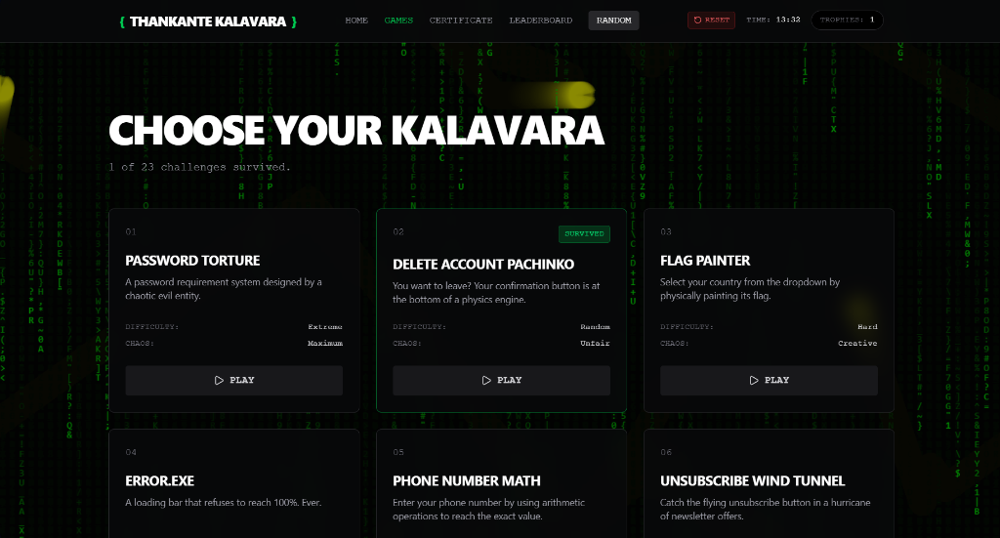
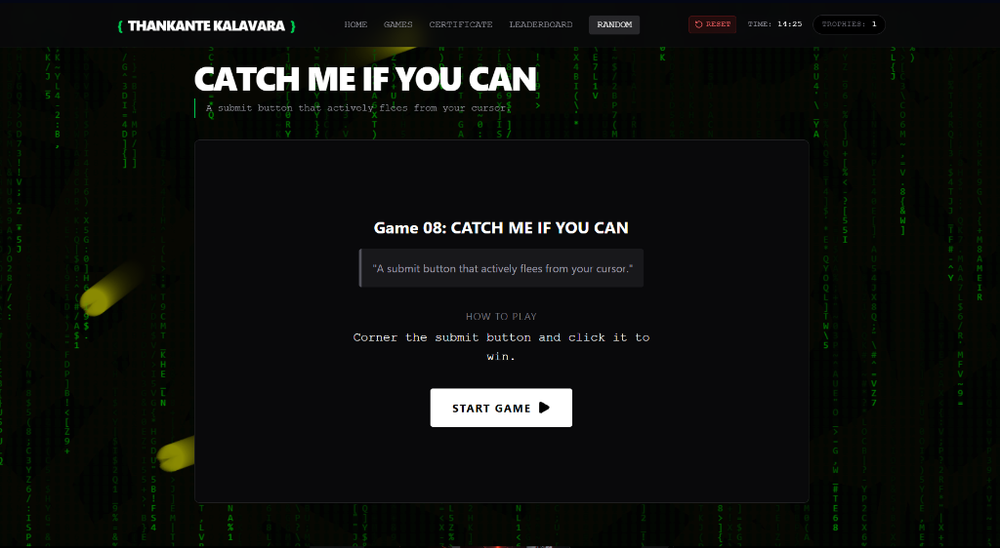
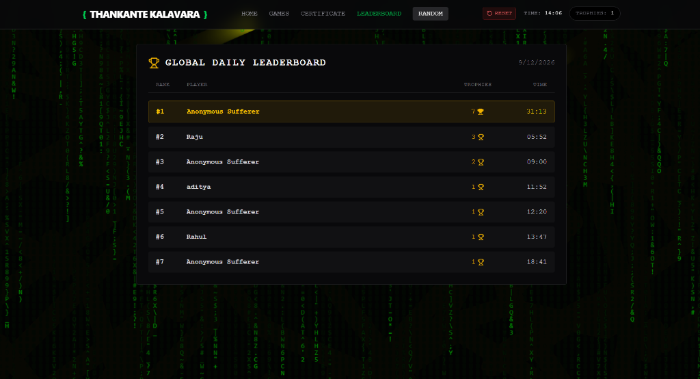
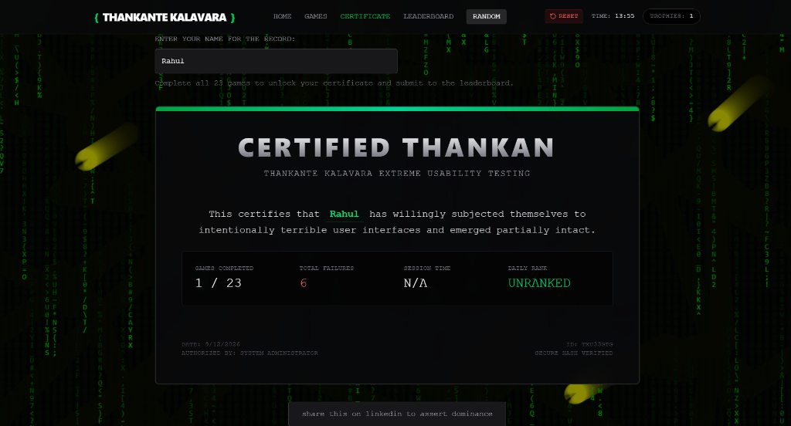
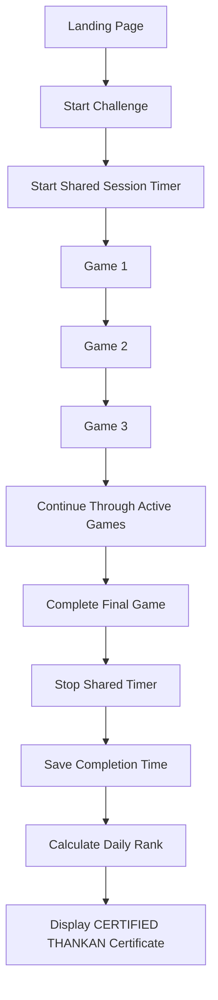
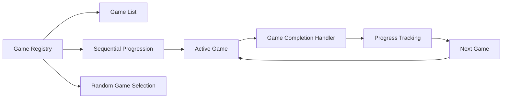
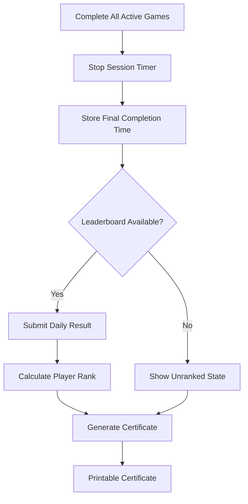

# Thankan's Kalavara 🎯

[**Live Demo — thankan's kalavara**](https://thankante-kalavara.vercel.app)

## Basic Details
### Team Name
La Squadra Execuzioni

### Team Members
- Adwaith Krishna MH — TKM College of Engineering, Kollam
- Abhinand JS — TKM College of Engineering, Kollam

### Project Description
Thankan's Kalavara is a deliberately frustrating collection of absurd mini-games and bad-UI challenges. The interface intentionally makes simple tasks difficult. Features include:
- Intentionally confusing and frustrating interfaces
- Multiple absurd mini-games
- Sequential game progression
- Shared session timer
- Game completion tracking
- Random game selection
- Daily leaderboard
- Clean printable certificate
- Final certificate title: CERTIFIED THANKAN

### The Problem (that doesn't exist)
Modern interfaces are too convenient and predictable. Users normally:
- Click buttons that stay where they are.
- Enter information normally.
- Understand what controls do.
- Complete tasks quickly.

This project solves the imaginary problem of interfaces being too usable.

### The Solution (that nobody asked for)
The project replaces ordinary UI interactions with intentionally frustrating challenges. 

## Technical Details

### Technologies
- React
- TypeScript
- Vite
- Tailwind CSS
- Browser Local Storage
- Git and GitHub

### For Hardware:
- No hardware required

## Implementation
The project implements a core framework containing:
- **Game registry**: Stores 23 dynamically loading mini-games.
- **Sequential progression**: Auto-advances uncompleted games until all are cleared.
- **Shared session timer**: Initiated on the first game and stops after the final challenge is completed.
- **Game completion state**: Uses the Context/Store API connected with local storage.
- **Random game selection**: Biased to pick uncompleted games.
- **LocalStorage persistence**: Keeps progress between refreshes.
- **Certificate generation**: Generates a dynamic summary with a simulated tracking hash.
- **Print-friendly certificate layout**: Hides non-essential UI via CSS print queries.
- **Daily leaderboard integration**: Simulated backend structure backed by LocalStorage, grouping runs by the current date.
- **Responsive UI**: Adjusts for small/large screens.
- **Timer and animation cleanup**: Proper teardown on component unmount and game resets.

## Installation

```bash
npm install
```

# Run

```bash
npm run dev
```

## Project Documentation

### For Software:
The architecture revolves around a global store (`store.ts`) that manages progression, attempts, fails, and the session timer. A central `GameLayout.tsx` handles wrapping each individual game component, rendering their statuses, handling navigation logic to the next game in the sequence, and broadcasting completion back to the store. 

# Screenshots


*Landing screen of Thankan's Kalavara.*


*Example of an intentionally frustrating game.*


*Daily Leaderboard tracking survival times.*


*Printable CERTIFIED THANKAN certificate.*

# Diagrams

### Overall application flow


### Game architecture


### Completion and leaderboard flow


The application uses a central game registry to manage active games, sequential progression, random selection, completion tracking, and the final certificate flow. A shared session timer measures the complete challenge run rather than individual game durations.

### Project Demo

# Video
<iframe width="560" height="315" src="https://www.youtube.com/embed/g8H_PIt81_c?si=d-8ULf2T7un0Ohff" title="YouTube video player" frameborder="0" allow="accelerometer; autoplay; clipboard-write; encrypted-media; gyroscope; picture-in-picture; web-share" referrerpolicy="strict-origin-when-cross-origin" allowfullscreen></iframe>
*Demonstrates the Thankan's Kalavara experience from the first challenge to the final certificate.*

# Additional Demos
[Add any extra demo materials or links here]

## Team Contributions
### Adwaith Krishna MH
- Frontend development
- UI implementation
- Game interface integration
- Game progression and overall website structure

### Abhinand JS
- JavaScript implementation
- Creative game ideas
- Debugging
- Game testing
- Interaction and gameplay improvements

---
Made with ❤️ at TinkerHub Useless Projects
